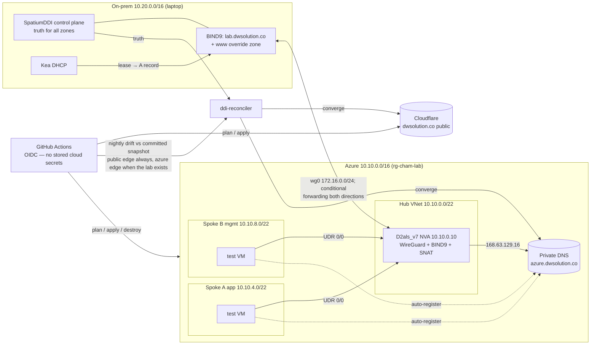
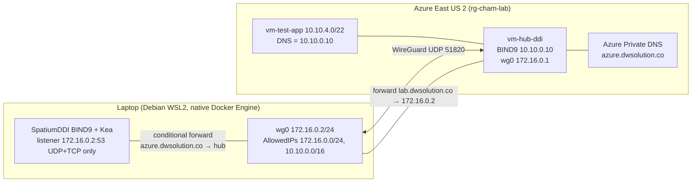

# Architecture

## System view

Every component and who talks to whom. The detailed Phase 3 data path, which
proves the tunnel half of this picture, follows below.

## Resolution paths

| Client | Query | Path | Answer |
|---|---|---|---|
| Spoke VM | `printer.lab.dwsolution.co` | VNet DNS → hub BIND9 → wg0 → laptop BIND9 | on-prem lease IP (10.20.x) |
| Spoke VM | `db.azure.dwsolution.co` | VNet DNS → hub BIND9 → 168.63.129.16 → Private DNS | 10.10.4.20 |
| Laptop | `db.azure.dwsolution.co` | Spatium BIND9 conditional forward → wg0 → hub BIND9 → Private DNS | 10.10.4.20 |
| Laptop (Spatium resolver) | `www.dwsolution.co` | Spatium BIND9 override zone | 10.10.0.10 — internal page, reachable while the tunnel is up |
| Hub resolver client | `www.dwsolution.co` | hub BIND9 has no `www` zone → recursion | public GitHub Pages addresses (ADR-007: the split horizon is the Spatium resolver's, not the hub's) |
| Internet | `www.dwsolution.co` | Cloudflare → CNAME → GitHub Pages | public page |
| Internet | `demo.dwsolution.co` | Cloudflare (reconciler-managed) | CNAME `www.dwsolution.co` |

One caveat this table must not hide: the SpatiumDDI `primary` group holds
`dwsolution.co.` itself as a primary zone, so a client using the Spatium
resolver gets an authoritative empty answer for the apex — the production
Microsoft 365 MX, SPF, and autodiscover records are invisible to it. Public
resolution is untouched; only lab-resolver clients are affected, and none of
them may depend on M365 mail discovery until that zone is narrowed.

## Phase 3 data path (proven live)

Phase 3 proved the hybrid data path live on 2026-08-06: SpatiumDDI on the
laptop and Azure Private DNS behave as one namespace across an encrypted
WireGuard split tunnel for a bounded window, then everything returns to a
deallocated, tunnel-down state.

The tunnel is split-route only; laptop internet egress stays on the home
path. The DNS data plane runs on the native Debian Docker Engine (Docker
Desktop stopped) and publishes only on the exact WireGuard transfer address
`172.16.0.2:53` over UDP and TCP.

## Proven resolution paths (Checkpoint B)

| Client | Query | Path | Answer source |
|---|---|---|---|
| Laptop | `db.azure.dwsolution.co` | Spatium BIND9 → conditional forward → hub BIND9 | Azure Private DNS seed |
| Laptop | `vm-test-app.azure.dwsolution.co` | same composed path | Azure auto-registration |
| Hub | `printer.lab.dwsolution.co` | hub BIND9 → tunnel → Spatium BIND9 | SpatiumDDI (lease-backed) |
| App | `printer.lab.dwsolution.co` | `resolvectl`/`dig` → hub BIND9 (10.10.0.10) → tunnel → Spatium | SpatiumDDI |
| App | `phase3-lease-<UTC>.lab.dwsolution.co` | same hop chain | Fresh Kea lease via automatic DDNS |

Every path was verified over both UDP and TCP.

## Addressing
| Block | Purpose |
|---|---|
| 10.20.0.0/16 | On-prem (SpatiumDDI-served) |
| 10.10.0.0/16 | Azure supernet |
| 10.10.0.0/22 | Hub VNet |
| 10.10.4.0/22 | Spoke A (app) |
| 10.10.8.0/22 | Spoke B (mgmt) |
| 172.16.0.0/24 | WireGuard transfer net |

## DNS zones
| Zone | Authority | Managed by |
|---|---|---|
| dwsolution.co (public) | Cloudflare | Terraform seeds (`www`, `external-check`) + reconciler allowlist (`demo`, `reconciler-check`) + **hand-managed Microsoft 365 production records** (MX, SPF/`MS=` TXT, autodiscover/sip/lyncdiscover, Intune CNAMEs, two SRV) that neither tool owns |
| lab.dwsolution.co | Laptop BIND9 (SpatiumDDI) | SpatiumDDI |
| azure.dwsolution.co | Azure Private DNS | Terraform seeds + reconciler allowlist + **Azure VM auto-registration** (`vm-*` records the platform writes; the reconciler blocks writes to any key it cannot prove manual) |
| www.dwsolution.co (internal view) | BIND9 override | SpatiumDDI (override zone created by hand in Task A3 — in the control plane, not in this repo; ADR-007) |

Ownership boundaries for the shared zones, and why they are three mechanisms
rather than one: Terraform refuses collisions (`allow_overwrite = false`) and
declares no zone resource; the reconciler's ADR-005 allowlist bounds every
record it may write; and the reconciler's record-type filter keeps MX/SRV —
including the production mail path — out of its model entirely. Azure
auto-registered records are additionally write-blocked at the provider layer
even when a managed key collides with one.
