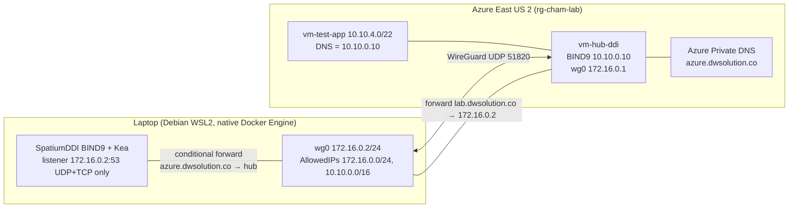

# Architecture

Phase 3 proved the hybrid data path live on 2026-08-06: SpatiumDDI on the
laptop and Azure Private DNS behave as one namespace across an encrypted
WireGuard split tunnel for a bounded window, then everything returns to a
deallocated, tunnel-down state.

The tunnel is split-route only; laptop internet egress stays on the home
path. The DNS data plane runs on the native Debian Docker Engine (Docker
Desktop stopped) and publishes only on the exact WireGuard transfer address
`172.16.0.2:53` over UDP and TCP.

## Proven resolution paths (Checkpoint B)

| Client | Query | Path | Answer source |
|---|---|---|---|
| Laptop | `db.azure.dwsolution.co` | Spatium BIND9 → conditional forward → hub BIND9 | Azure Private DNS seed |
| Laptop | `vm-test-app.azure.dwsolution.co` | same composed path | Azure auto-registration |
| Hub | `printer.lab.dwsolution.co` | hub BIND9 → tunnel → Spatium BIND9 | SpatiumDDI (lease-backed) |
| App | `printer.lab.dwsolution.co` | `resolvectl`/`dig` → hub BIND9 (10.10.0.10) → tunnel → Spatium | SpatiumDDI |
| App | `phase3-lease-<UTC>.lab.dwsolution.co` | same hop chain | Fresh Kea lease via automatic DDNS |

Every path was verified over both UDP and TCP.

## Addressing
| Block | Purpose |
|---|---|
| 10.20.0.0/16 | On-prem (SpatiumDDI-served) |
| 10.10.0.0/16 | Azure supernet |
| 10.10.0.0/22 | Hub VNet |
| 10.10.4.0/22 | Spoke A (app) |
| 10.10.8.0/22 | Spoke B (mgmt) |
| 172.16.0.0/24 | WireGuard transfer net |

## DNS zones
| Zone | Authority | Managed by |
|---|---|---|
| dwsolution.co (public) | Cloudflare | Terraform infrastructure/seeds + reconciler-owned record set |
| lab.dwsolution.co | Laptop BIND9 (SpatiumDDI) | SpatiumDDI |
| azure.dwsolution.co | Azure Private DNS | Terraform seeds + reconciler |
| www.dwsolution.co (internal view) | BIND9 override | SpatiumDDI |
