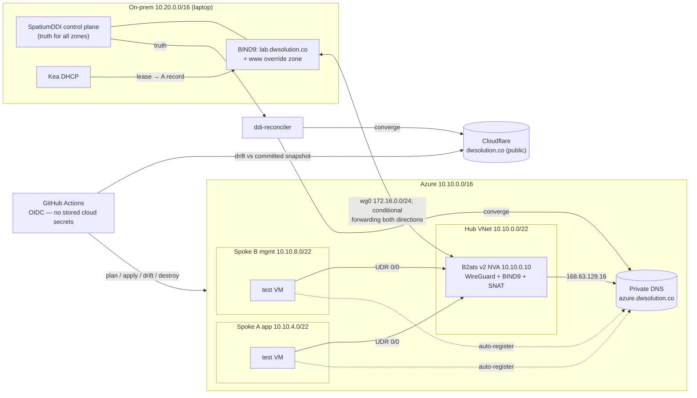

# Phase 5 — CI/CD Pipeline Implementation Plan

> **For agentic workers:** REQUIRED SUB-SKILL: Use superpowers:subagent-driven-development (recommended) or superpowers:executing-plans to implement this plan task-by-task. Steps use checkbox (`- [ ]`) syntax for tracking. Many steps are `az`/`gh` operations with expected outputs — those ARE the test cycle.

**Goal:** The four authored workflows actually working end to end: plan-on-PR with lint/security gates, environment-approved apply, nightly drift detection that opens issues, and the destroy kill switch — all authenticated to Azure via OIDC federation with zero stored cloud secrets.

**Architecture:** One Entra ID app registration with three federated credentials (main branch, pull requests, `lab` environment), Contributor on the subscription, and Storage Blob Data Contributor on the Terraform state account. GitHub holds only identifiers (client/tenant/subscription IDs) plus lab config values as secrets; Terraform authenticates natively via OIDC. Post-review baseline workflows now set the complete ARM environment, resolve the randomized backend account, and require a short-lived saved-plan artifact whose workflow run, current-main commit, manifest, and SHA-256 are verified before environment-approved apply. The drift workflow is rewritten to use the Phase 4 CLI's exit-code contract (0/2/1) against the committed `desired-records.json` snapshot (ADR-006), gated on whether the lab currently exists. A second plan/apply job pair covers the `terraform/cloudflare` stack and must preserve the same exact-artifact invariant.

**Tech Stack:** GitHub Actions, `gh` CLI, `az` CLI, Entra ID workload identity federation, `astral-sh/setup-uv`, tflint (+azurerm ruleset), checkov.

## Global Constraints

- **No stored cloud credentials.** `AZURE_CLIENT_ID`/`AZURE_TENANT_ID`/`AZURE_SUBSCRIPTION_ID` are identifiers, not secrets (stored as secrets anyway, harmless). No client secrets, no PATs, no storage keys, ever. `CLOUDFLARE_API_TOKEN` is the one true secret (Cloudflare has no OIDC federation) — scoped to one zone.
- Prerequisites: Phase 2 (backend storage account, applied stack), Phase 4 (reconciler CLI + `desired-records.json`) for Tasks 4–5. Tasks 1–3 need only Phase 2.
- Exit-code contract from Phase 4 is law: 0 converged / 2 drift / 1 error. The drift workflow keys off it.
- Workflow YAML changes are only testable by running them — every workflow gets at least one real, evidenced run (URL captured) before the phase closes.
- Evidence: `docs/evidence/phase5/notes.md` collects run URLs and outcomes.

## Task Dependency / Parallelism Map

```
Task 1 (GitHub repo settings)  ─┐  parallelizable
Task 2 (Azure OIDC identity)   ─┘
        └─→ Task 3 (secrets + vars)        [needs Task 2's APP_ID; Task 1's final repo slug]
Task 4 (workflow fixes)                    [parallelizable with 1–3; pure file edits]
        └─→ Task 5 (end-to-end pipeline proof)   [needs 1+2+3+4; drift needs Phase 4]
              └─→ Task 6 (docs finalization + README)
```

---

### Task 1: GitHub repo settings — slug, environment, branch protection

The remote is `ilee165/aletheia` but the project is `cham`. OIDC federated-credential subjects embed the repo slug, so settle the name FIRST.

- [ ] **Step 1: Rename the GitHub repo to match the project (recommended), then push**

```bash
gh repo rename cham        # remote becomes ilee165/cham; git remote is updated in place
git push origin main
REPO=$(gh repo view --json nameWithOwner -q .nameWithOwner)
echo "$REPO"               # → ilee165/cham — used in every subject below
```
(Keeping `aletheia` also works — then every `$REPO` below resolves to `ilee165/aletheia`. Do not mix.)

- [ ] **Step 2: Create the `lab` environment with a required reviewer (the apply gate)**

```bash
gh api --method PUT "repos/$REPO/environments/lab" --input - <<EOF
{"reviewers": [{"type": "User", "id": $(gh api user -q .id)}]}
EOF
```
Expected: JSON response containing `"name": "lab"` and one reviewer. Verify in the UI: Settings → Environments → lab → Required reviewers shows your user. This is what makes `apply.yml`'s `environment: lab` line an actual manual-approval gate.

- [ ] **Step 3: Branch protection on `main` requiring both plan jobs**

```bash
gh api --method PUT "repos/$REPO/branches/main/protection" --input - <<'EOF'
{
  "required_status_checks": {"strict": true, "checks": [{"context": "plan"}, {"context": "plan-cloudflare"}]},
  "enforce_admins": false,
  "required_pull_request_reviews": null,
  "restrictions": null
}
EOF
```
Expected: response echoes the two required checks. (`plan-cloudflare` is added in Task 4 — the protection rule simply waits for it. No required human review: solo-maintainer repo; the status checks are the gate.)

---

### Task 2: Azure OIDC identity — app registration, federated credentials, role

*Parallelizable with Task 1 except the subjects need the final `$REPO` slug — run Step 3 after Task 1 Step 1.*

- [ ] **Step 1: App registration + service principal**

```bash
SUB_ID=$(az account show --query id -o tsv)
APP_ID=$(az ad app create --display-name gha-cham --query appId -o tsv)
az ad sp create --id "$APP_ID"
echo "APP_ID=$APP_ID"
```

- [ ] **Step 2: Role assignments — Contributor plus state-blob data access**

```bash
az role assignment create --assignee "$APP_ID" --role Contributor --scope "/subscriptions/$SUB_ID"
TFSTATE_ACCOUNT_NAME=$(az storage account list --resource-group rg-cham-tfstate --query '[0].name' -o tsv)
STATE_ACCOUNT_ID=$(az storage account show --resource-group rg-cham-tfstate --name "$TFSTATE_ACCOUNT_NAME" --query id -o tsv)
az role assignment create --assignee "$APP_ID" --role "Storage Blob Data Contributor" --scope "$STATE_ACCOUNT_ID"
```
Why subscription scope, not RG scope: the stack creates the resource group itself, and `azurerm_consumption_budget_subscription` is a subscription-scoped resource. (A least-privilege custom role is the production answer; declined at lab scale — note it in the ADR-ish comment if asked in review.) Contributor does **not** grant blob data-plane access. The backend sets `use_azuread_auth = true` and the storage account disables shared keys, so the CI principal also needs Storage Blob Data Contributor scoped to the state account.

- [ ] **Step 3: Three federated credentials — one per workflow trigger context**

```bash
REPO=$(gh repo view --json nameWithOwner -q .nameWithOwner)
for SUBJECT in "repo:$REPO:ref:refs/heads/main" "repo:$REPO:pull_request" "repo:$REPO:environment:lab"; do
  NAME=$(echo "$SUBJECT" | tr ':/' '--')
  az ad app federated-credential create --id "$APP_ID" --parameters "{
    \"name\": \"${NAME:0:120}\",
    \"issuer\": \"https://token.actions.githubusercontent.com\",
    \"subject\": \"$SUBJECT\",
    \"audiences\": [\"api://AzureADTokenExchange\"]
  }"
done
az ad app federated-credential list --id "$APP_ID" --query '[].subject' -o tsv
```
Expected: the three subjects listed. Mapping: `pull_request` → plan jobs; `environment:lab` → apply jobs (environment-gated jobs present the environment subject); `ref:refs/heads/main` → drift (scheduled/dispatched on the default branch) and destroy.

---

### Task 3: GitHub secrets and variables

*Depends on Task 2 ($APP_ID) and Task 1 (repo slug). Values come from the local Phase 2 tfvars/session env.*

- [ ] **Step 1: Set all seven secrets + the Cloudflare token + the one variable**

```bash
gh secret set AZURE_CLIENT_ID       --body "$APP_ID"
gh secret set AZURE_TENANT_ID       --body "$(az account show --query tenantId -o tsv)"
gh secret set AZURE_SUBSCRIPTION_ID --body "$SUB_ID"
gh secret set HOME_IP               --body "$(curl -4 -s ifconfig.me)/32"
gh secret set SSH_PUBLIC_KEY        --body "$(cat ~/.ssh/id_ed25519.pub)"
gh secret set WG_PEER_PUBLIC_KEY    --body "$(cat ~/.wg/cham-laptop.pub)"
gh secret set ALERT_EMAIL           --body "<alert email address>"
gh secret set CLOUDFLARE_API_TOKEN  --body "$CLOUDFLARE_API_TOKEN"
gh variable set BUDGET_START_DATE   --body "2026-08-01T00:00:00Z"
```

- [ ] **Step 2: Verify**

```bash
gh secret list && gh variable list
```
Expected: 8 secrets, 1 variable. Two documented staleness caveats (add them to the runbook in Task 6): `HOME_IP` must be re-set when the ISP rotates the home address (symptom: CI applies an NSG that locks you out of SSH/WireGuard); `BUDGET_START_DATE` must be bumped to the current month if a fresh CI apply ever fails validation on the budget start date.

---

### Task 4: Workflow fixes — OIDC env, drift rewrite, Cloudflare jobs, scanner config

*Post-review baseline already fixed the Azure workflow authentication/backend gap and replaced fresh auto-apply/raw destroy with exact saved-plan artifact promotion. Preserve those gates. Remaining work here is: (a) verify repository/environment settings and the two required Azure roles; (b) rewrite `drift.yml`, which calls a nonexistent `ddi-reconciler/cli.py` with ad-hoc pip installs and treats every failure as drift; and (c) add Cloudflare CI using the same reviewed-artifact model.*

**Files:**
- Modify: `.github/workflows/plan.yml`, `.github/workflows/apply.yml`, `.github/workflows/destroy.yml`
- Rewrite: `.github/workflows/drift.yml`
- Create: `terraform/.tflint.hcl`

**Interfaces:**
- Consumes: `cham-reconcile` exit codes and `--desired-from-file`/`--edge` flags (Phase 4 B4), `desired-records.json` (Phase 4 C1), job names `plan`/`plan-cloudflare` (Task 1's branch protection).

- [ ] **Step 1: Add the full OIDC env to every Terraform step (all four workflows)**

In `plan.yml`, `apply.yml`, `destroy.yml`, extend the `env:` block of each `terraform`-running step (Plan / Apply / Destroy) with:

```yaml
          ARM_CLIENT_ID: ${{ secrets.AZURE_CLIENT_ID }}
          ARM_TENANT_ID: ${{ secrets.AZURE_TENANT_ID }}
          ARM_SUBSCRIPTION_ID: ${{ secrets.AZURE_SUBSCRIPTION_ID }}
```
(`ARM_USE_OIDC: "true"` is already there; with these three the azurerm provider and the azurerm backend both authenticate natively via the Actions OIDC token. The `azure/login` step stays wherever `az` CLI commands run — e.g. destroy's leftover check and drift's gate.)

- [ ] **Step 2: Add the `plan-cloudflare` job to `plan.yml`**

Append as a second job (sibling of `plan`):

```yaml
  plan-cloudflare:
    runs-on: ubuntu-latest
    defaults:
      run:
        working-directory: terraform/cloudflare
    steps:
      - uses: actions/checkout@v4
      - uses: hashicorp/setup-terraform@v3
      - name: Plan
        env:
          ARM_USE_OIDC: "true"
          ARM_CLIENT_ID: ${{ secrets.AZURE_CLIENT_ID }}
          ARM_TENANT_ID: ${{ secrets.AZURE_TENANT_ID }}
          ARM_SUBSCRIPTION_ID: ${{ secrets.AZURE_SUBSCRIPTION_ID }}
          CLOUDFLARE_API_TOKEN: ${{ secrets.CLOUDFLARE_API_TOKEN }}
        run: |
          terraform init
          terraform plan -no-color -out=cloudflare.tfplan
          sha256sum cloudflare.tfplan
```

- [ ] **Step 3: Add the `apply-cloudflare` job to `apply.yml`**

```yaml
  apply-cloudflare:
    runs-on: ubuntu-latest
    environment: lab
    defaults:
      run:
        working-directory: terraform/cloudflare
    steps:
      - uses: actions/checkout@v4
      - uses: hashicorp/setup-terraform@v3
      - name: Apply
        env:
          ARM_USE_OIDC: "true"
          ARM_CLIENT_ID: ${{ secrets.AZURE_CLIENT_ID }}
          ARM_TENANT_ID: ${{ secrets.AZURE_TENANT_ID }}
          ARM_SUBSCRIPTION_ID: ${{ secrets.AZURE_SUBSCRIPTION_ID }}
          CLOUDFLARE_API_TOKEN: ${{ secrets.CLOUDFLARE_API_TOKEN }}
        run: |
          terraform init
          # Download and hash-verify the exact reviewed artifact first.
          terraform apply -input=false cloudflare.tfplan
```

The Cloudflare jobs must mirror the Azure trust chain: manual plan on current
`main`, short-lived artifact plus manifest/hash, environment approval, exact
commit/run/repository/hash verification, then saved-plan apply. A fresh plan in
the apply job or raw `-auto-approve` is not permitted.

- [ ] **Step 4: Rewrite `drift.yml` completely**

```yaml
name: nightly-drift
on:
  schedule:
    - cron: "0 6 * * *"   # 06:00 UTC nightly
  workflow_dispatch:

permissions:
  id-token: write
  contents: read
  issues: write

jobs:
  drift:
    runs-on: ubuntu-latest
    steps:
      - uses: actions/checkout@v4

      - uses: astral-sh/setup-uv@v6

      - uses: azure/login@v2
        with:
          client-id: ${{ secrets.AZURE_CLIENT_ID }}
          tenant-id: ${{ secrets.AZURE_TENANT_ID }}
          subscription-id: ${{ secrets.AZURE_SUBSCRIPTION_ID }}

      # The lab is destroyed between sessions (cost posture) — Azure edge
      # drift is only meaningful while it exists. Cloudflare is always up.
      - name: Gate on lab presence
        id: gate
        run: echo "lab_up=$(az group exists --name rg-cham-lab)" >> "$GITHUB_OUTPUT"

      - name: Reconciler dry-run against committed snapshot (ADR-006)
        id: reconcile
        working-directory: ddi-reconciler
        env:
          CLOUDFLARE_API_TOKEN: ${{ secrets.CLOUDFLARE_API_TOKEN }}
          AZURE_SUBSCRIPTION_ID: ${{ secrets.AZURE_SUBSCRIPTION_ID }}
        run: |
          EDGES="--edge cloudflare-public"
          if [ "${{ steps.gate.outputs.lab_up }}" = "true" ]; then
            EDGES="$EDGES --edge azure-private"
          fi
          set +e
          uv run cham-reconcile --dry-run --desired-from-file desired-records.json $EDGES | tee drift.txt
          echo "code=$?" >> "$GITHUB_OUTPUT"

      - name: Open issue on drift (exit 2)
        if: steps.reconcile.outputs.code == '2'
        uses: actions/github-script@v7
        with:
          script: |
            const fs = require('fs');
            const drift = fs.readFileSync('ddi-reconciler/drift.txt', 'utf8');
            github.rest.issues.create({
              ...context.repo,
              title: `DNS drift detected — ${new Date().toISOString().slice(0,10)}`,
              body: `Nightly reconciler dry-run found drift:\n\`\`\`\n${drift}\n\`\`\``,
              labels: ['drift']
            });

      - name: Fail on operational error (exit 1)
        if: steps.reconcile.outputs.code == '1'
        run: |
          echo "::error::reconciler exited 1 (operational error, NOT drift) — see log above"
          exit 1
```
(GitHub's default `bash -e -o pipefail` shell means `$?` after the `| tee` pipeline is the reconciler's exit code; `set +e` keeps the step alive to record it. DefaultAzureCredential picks up the `azure/login` CLI session for the Azure edge.)

- [ ] **Step 5: tflint configuration — `terraform/.tflint.hcl`**

```hcl
plugin "terraform" {
  enabled = true
  preset  = "recommended"
}

plugin "azurerm" {
  enabled = true
  source  = "github.com/terraform-linters/tflint-ruleset-azurerm"
  version = "0.27.0"
}
```

Run locally and fix what it finds before CI does:
```bash
cd terraform && tflint --init && tflint --recursive
```
Expected after fixes: exit 0.

- [ ] **Step 6: checkov triage — run locally, fix or justify every finding**

```bash
uvx checkov -d terraform --quiet --compact
```
`plan.yml` runs checkov with `soft_fail: false`, so anything unaddressed blocks every PR. For each finding, either fix the resource or add an inline, justified skip directly above it, e.g. on the bootstrap storage account:

```hcl
resource "azurerm_storage_account" "state" {
  # checkov:skip=CKV2_AZURE_33: lab-scale tfstate store; private endpoint out of cost posture
  # checkov:skip=CKV2_AZURE_1: platform-managed encryption is sufficient for lab tfstate
  # checkov:skip=CKV_AZURE_33: queue logging n/a — blob-only state container
  ...
```
Likely candidates from the resources in this repo: storage-account hardening family (private endpoint, CMK, SAS policy, shared-key auth, logging), NSG breadth rules, VM extension/identity checks. The rule: every skip carries a reason that survives an interview question. Re-run until exit 0.

- [ ] **Step 7: Commit**

```bash
git add .github/workflows terraform/.tflint.hcl terraform/
git commit -m "ci: native OIDC env for terraform, cloudflare jobs, drift rewrite on 0/2/1 contract, scanner configs"
```

---

### Task 5: End-to-end pipeline proof (the phase's test cycle)

*Depends on Tasks 1–4 pushed to `main`. Steps 4–5 depend on Phase 4 complete. Capture every run URL into `docs/evidence/phase5/notes.md`.*

- [ ] **Step 1: PR → plan gate.** Branch `ci-smoke`; make a trivially safe change (add `phase = "5"` to the `locals.tags` map in `terraform/envs/lab/main.tf`); push; open a PR.
Expected: `plan` and `plan-cloudflare` checks run green (fmt, tflint, checkov, both plans); a PR comment appears containing the lab plan showing tag-only in-place updates; merge is blocked until the checks pass.

- [ ] **Step 2: Merge → gated apply.** Merge the PR.
Expected: `terraform-apply` starts and **pauses** at "Waiting for review" on environment `lab`. Approve it in the UI. Both apply jobs complete: lab job updates tags in place (or creates the full stack if the lab was down — fine, destroy after), cloudflare job no-ops.

- [ ] **Step 3: Drift, green path.** Actions → nightly-drift → Run workflow.
Expected: gate resolves lab presence correctly either way; reconciler prints `converged (0 changes)` per active edge; run green; **no** issue created.

- [ ] **Step 4: Drift, red path.** In the Cloudflare dashboard, change `demo`'s CNAME target to `example.com`. Dispatch nightly-drift again.
Expected: run green (drift is a *finding*, not a failure), and a new issue labeled `drift` titled `DNS drift detected — <date>` whose body shows the `UPDATE demo` line. Heal (`uv run cham-reconcile --apply` locally), close the issue, dispatch once more → no new issue.

- [ ] **Step 5: Destroy from CI.** Actions → terraform-destroy → Run workflow → type `DESTROY`.
Expected: full teardown; the leftover-check step lists nothing in `rg-cham-lab` (or the RG is gone); `az group exists --name rg-cham-lab` → `false` locally. This also re-proves the runbook's session-end path works from a phone.

- [ ] **Step 6: Commit the evidence file** (`docs/evidence/phase5/notes.md` with the five run URLs and one-line outcomes).

---

### Task 6: Docs finalization

*Depends on Task 5 (so the claims are true when written).*

**Files:**
- Modify: `docs/architecture.md` (replace the "copy from build plan" TODO), `README.md:47`, `docs/runbook.md`

- [ ] **Step 1: Replace the architecture TODO with the rendered diagram + resolution-path table**

Replace the parenthetical note at the top of `docs/architecture.md` with:

````markdown


## Resolution paths
| Client | Query | Path | Answer |
|---|---|---|---|
| Spoke VM | printer.lab.dwsolution.co | VNet DNS → hub BIND9 → wg0 → laptop BIND9 | on-prem lease IP (10.20.x) |
| Spoke VM | db.azure.dwsolution.co | VNet DNS → hub BIND9 → 168.63.129.16 → Private DNS | 10.10.4.20 |
| Laptop | db.azure.dwsolution.co | Spatium BIND9 cond-fwd → wg0 → hub BIND9 → Private DNS | 10.10.4.20 |
| Laptop (tunnel up) | www.dwsolution.co | Spatium BIND9 override zone | 10.10.0.10 → internal page |
| Internet | www.dwsolution.co | Cloudflare → CNAME → GitHub Pages | public page |
| Internet | demo.dwsolution.co | Cloudflare (reconciler-managed) | CNAME www.dwsolution.co |
````

(Keep the existing Addressing and DNS zones tables below it.)

- [ ] **Step 2: Runbook CI section**

Append to `docs/runbook.md`:

```markdown
## CI notes
- Apply is gated on the `lab` environment — approve in Actions when intended.
- Nightly drift compares edges to ddi-reconciler/desired-records.json (ADR-006).
  End every session that changed truth with `cham-reconcile --export` + commit.
- Drift issues carry the `drift` label; heal with `cham-reconcile --apply`, close.
- If plan/apply fails auth: HOME_IP secret may be stale (ISP rotation) or the
  BUDGET_START_DATE variable needs bumping to the current month.
- Kill switch from anywhere: Actions → terraform-destroy → type DESTROY.
```

- [ ] **Step 3: Check the last box and commit**

Set `- [x] Phase 5 — CI/CD pipeline` in `README.md`.

```bash
git add README.md docs/
git commit -m "docs: phase 5 complete — pipeline proven end to end; architecture diagram live"
git push origin main
```

---

## Exit Criteria (all must hold)

1. Zero stored cloud credentials: secrets list contains only OIDC identifiers, lab config values, and the scoped Cloudflare token — no client secrets, PATs, or storage keys anywhere.
2. A PR touching `terraform/**` cannot merge without green fmt + tflint + checkov + both plan jobs, and the plan is readable as a PR comment.
3. Merged changes apply only after a human approves the `lab` environment gate; both stacks (lab, cloudflare) apply from CI.
4. nightly-drift: green + silent when converged; opens a labeled issue containing the exact diff on real drift; fails loudly (exit 1 path) on operational errors; skips the Azure edge cleanly when the lab is destroyed.
5. destroy.yml empties the lab from the Actions UI behind the typed `DESTROY` confirmation.
6. checkov and tflint pass with zero unaddressed findings — every skip carries a written justification.
7. All five workflow runs evidenced by URL in `docs/evidence/phase5/notes.md`; architecture diagram + resolution-path table published; all five README phase boxes checked.

## What Completion Looks Like

The repo operates itself: propose a change and CI shows exactly what would happen; merge it and nothing touches Azure until a human clicks approve; every night the edges are compared against committed truth and tampering becomes a labeled issue with the diff inline; and the whole lab can be vaporized from a phone with one typed word. A reviewer walking the repo sees plan output on PRs, drift issues with evidence, justified scanner skips, ADRs for every tradeoff, and — nowhere — a credential.
