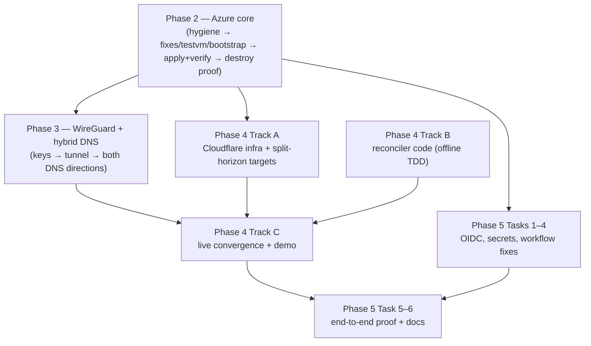

# cham — Phases 2–5 Overview

Written 2026-07-31 after a full repo review. Phase 1 (local SpatiumDDI, zones, DHCP→DNS) is complete. This file maps the four remaining phases; each has its own detailed plan in this directory.

| Phase | Plan file | Thrust |
|---|---|---|
| 2 | `2026-07-31-phase-2-azure-core.md` | Apply + verify the authored Azure stack (hub/spokes/peering/NSG/UDR/Private DNS) |
| 3 | `2026-07-31-phase-3-wireguard-hybrid-dns.md` | Tunnel + bidirectional conditional forwarding |
| 4 | `2026-07-31-phase-4-cloudflare-reconciler-v2.md` | Public zone, split horizon, working reconciler |
| 5 | `2026-07-31-phase-5-cicd.md` | OIDC, plan-on-PR, gated apply, drift issues, destroy switch |

## Review findings the plans are built around

The repo is much further along than "phases unstarted" suggests — Terraform, workflows, and the reconciler core are all *authored* — but none of it has ever run, and the review found real defects each plan fixes at its start:

1. **Reconciler package cannot build** — hatchling can't map the `src/*.py` + top-level `providers/` layout to `ddi_reconciler`; `uv run pytest` dies before collecting tests. *(Phase 4 B1)*
2. **`CanonicalRecord.key` crashes at runtime** — `model.py:89` calls the `RecordKey` type alias like a constructor (`tuple expected at most 1 argument`). 21 of 37 tests fail once the package builds (verified via a symlink harness). *(Phase 4 B1)*
3. **Five validation messages disagree with the test suite** (`zone is required` vs expected `zone must not be empty`, etc.). *(Phase 4 B1)*
4. **`providers/azure.py` ends with a dangling `from`** — a syntax error sitting uncommitted. *(Phase 2 Task 0)*
5. **Whole-tree CRLF/LF churn** — every file shows ±100% modified; needs `.gitattributes` + renormalize before any real commits. *(Phase 2 Task 0)*
6. **Hub BIND9 ACLs omit the tunnel** — `allow-query` lacks `172.16.0.0/24` and `allow-recursion` is unset (BIND's default would refuse the spokes). Phase 3 would dead-end without this. *(Phase 2 Task 1)*
7. **No NVA SNAT** — spokes default-route through the hub but nothing masquerades internet-bound traffic; spoke egress would silently fail. *(Phase 2 Task 1)*
8. **Spoke NSGs block tunnel-sourced traffic** — laptop packets arrive as `172.16.0.2`, matching no allow rule. *(Phase 2 Task 1)*
9. **No workload in the spokes** — UDRs, auto-registration, and isolation are unverifiable without a NIC; plans add a flag-gated per-spoke test VM. *(Phase 2 Task 2)*
10. **`drift.yml` invokes a file that doesn't exist** (`ddi-reconciler/cli.py`), pip-installs ad hoc, and treats *any* failure as drift. *(Phase 5 Task 4)*
11. **Workflows set `ARM_USE_OIDC` but never `ARM_CLIENT_ID`/`ARM_TENANT_ID`** — Terraform's provider and backend would fail auth in CI. *(Phase 5 Task 4)*
12. **CI can't reach SpatiumDDI** (laptop, home NAT, stack usually down) — nightly drift as conceived is impossible; resolved via a committed desired-state snapshot + `--desired-from-file` mode (new ADR-006). *(Phase 4 B2/C1, Phase 5 Task 4)*
13. **Comment/ADR contradictions** — `private-dns` comment says the reconciler owns seed records (ADR-005 says the opposite); `spoke` NSG comment claims "allow via hub" while the rules (correctly) deny it. *(Phase 2 Task 1)*
14. **`www` public record needs a real page target** for the split-horizon browser demo — plan switches it to a CNAME at a GitHub Pages site, with an internal page served by the hub. *(Phase 4 A2)*
15. **Remote slug mismatch** — GitHub remote is `ilee165/aletheia`, project is `cham`; OIDC federated-credential subjects embed the slug, so the rename decision gates Phase 5. *(Phase 5 Task 1)*
16. **Backend placeholders** (`REPLACE_FROM_BOOTSTRAP_OUTPUT`) in both stacks — expected, resolved by the bootstrap task. *(Phase 2 Task 3)*

## Dependency graph and parallelism

**What can run concurrently:**
- **Phase 4 Track B (reconciler code) is fully offline** — no Azure session, no credentials. It is the ideal "no-lab-time" work and can start immediately, even before Phase 2 finishes.
- Phase 4 Track A (Cloudflare zone activation, token, terraform edits) is independent of Phases 2–3 except for the backend storage account (Phase 2 Task 3). Nameserver delegation takes hours — start A1 early.
- Phase 5 Tasks 1–4 (identity, secrets, workflow file fixes) need only Phase 2; they can proceed while Phase 3/4 live work happens.
- Within phases, parallel-safe tasks are marked in each plan's dependency map.

**What is strictly ordered:** Phase 2 before Phase 3 (the tunnel terminates on the hub VM); Tracks A+B+Phase 3 before Phase 4 Track C (live convergence + browser demo); everything before Phase 5 Task 5 (the pipeline proof exercises the whole system).

**Azure-session batching (cost posture):** live work clusters into ~3 paid-nothing-but-time sessions — (1) Phase 2 apply/verify/destroy, (2) Phase 3 tunnel + DNS with the same stack up, (3) Phase 4 Track C + Phase 5 proof. Everything else is laptop-only.

## Exit criteria digest

- **Phase 2:** stack applies unattended from tfvars alone; peering/UDR/DNS/isolation/egress-via-NVA each verified by a captured command; auto-registration visible; destroy leaves `az group exists` false and a re-plan offers the full stack; evidence committed. **Done = one command up, nine proofs, one command down.**
- **Phase 3:** persistent handshake; four resolution vantage points proven (laptop→azure zone, spoke→lab zone, hub→lab zone, laptop→auto-registered); fresh DHCP lease resolvable from Azure; split tunnel confirmed; no key material anywhere in git/state. **Done = two DNS planes behave as one, demoable in a split screen.**
- **Phase 4:** full offline test suite green with zero credentials; live convergence + idempotency + tamper-healing on both edges; byte-identical before/after proof for seeds and auto-registered records; split-horizon `www` captured both ways; snapshot + ADR-006 committed. **Done = `--dry-run` answers "does the world match intent?" and `--apply` makes it true, provably unable to touch what it doesn't own.**
- **Phase 5:** PR-blocked-without-green-plan; environment-gated apply; drift issue with inline diff on real drift and silence when converged; CI destroy behind typed confirmation; zero stored cloud credentials; scanners clean with justified skips; architecture diagram published; all five README boxes checked. **Done = the repo runs itself and a reviewer can verify every claim from artifacts.**
